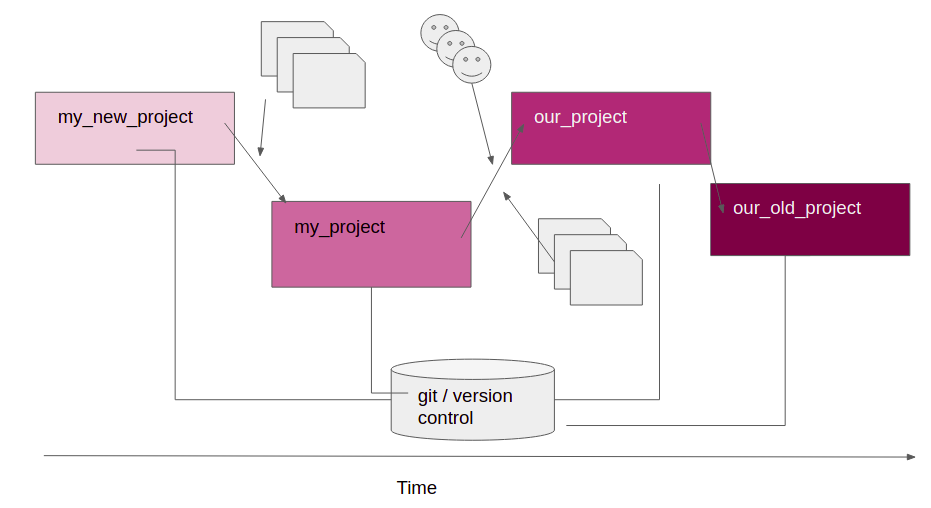
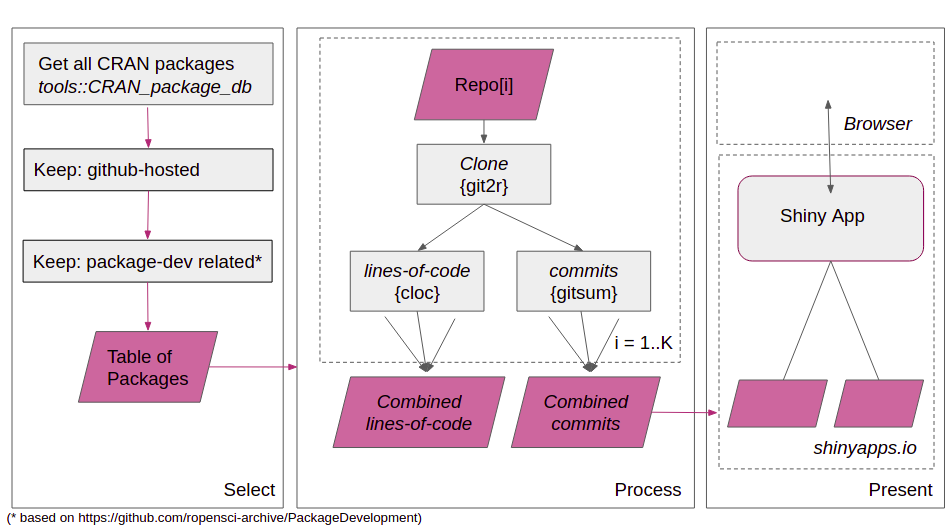

# code-as-data

## Introduction

Programming projects grow over time. New contributors join, new features are
added, complexity increases. As this happens, the version-control history of the
project becomes a valuable source of data. You might want to know:

- who is the main contributor to this particular file?

- if I change this file, are there any other files that I might need to look at?

- are there any files that should be combined together, or split apart?



Here, we have obtained the source code and version-control history for a range
of R packages. For each package, the changes to individual files can be mapped
out over history.

The packages studied were all related to package-development.

There is a shiny-app that presents the results from the analysis
[at shinyapps.io](https://russ-hyde.shinyapps.io/code-as-data/).



## Environment

This project uses
- `conda` to manage the python-based and command-line tools and to install the
base R release
- and `renv` to manage the installation of any R packages

To set up the project, first install the `conda` environment, activate it, then
install the `renv` environment

Once you've got `conda` installed:

```
# To create an identical environment (req Ubuntu)
conda create --name code-as-data --file conda/requirements.txt
```

```
# To create a similar environment
conda env create --file conda/environment.yml --name code-as-data
```

Activate the conda environment

```
conda activate code-as-data
```

To install the R environment (and also make any non-version-controlled
directories: data, results etc):

```
./setup
```

----

To run the analysis:

Once the environment is setup and activated use the bash script to run the
workflow

```
./run
```

If you want the data or results to be stored to a specific location, set up
links to these positions before running `./run`.
